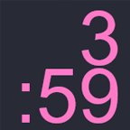

# Stream Deck Digital Clock

Trying to take Elgato's analog clock and make it simpler and easier to read at a glance.

## TODO

- [x] Make it work
- [x] Re-name all the stuff that was stolen from Elgato's analogue clock
- [ ] Allow font changing maybe?

### Links

- [Create your own plugin, says Elgato](https://developer.elgato.com/documentation/stream-deck/sdk/create-your-own-plugin/)
- [Stream Deck SDK](https://help.elgato.com/hc/en-us/articles/360028243711-Elgato-Stream-Deck-SDK-Use-Software-Version-4-0-and-Above)
- [Developer Docs](https://developer.elgato.com/documentation/stream-deck/sdk/overview/)
